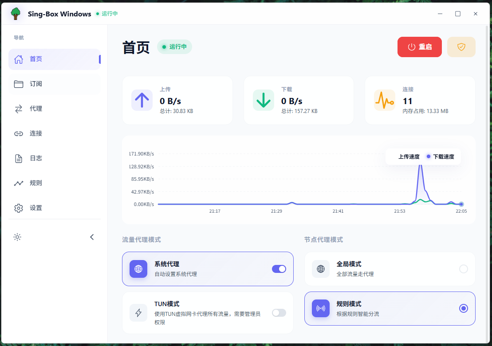

<div align="center">
  

  <h1>Sing-Box Windows</h1>

  <p>
    <strong>A cross-platform sing-box GUI client for Windows, Linux, and macOS built with Tauri 2 + Vue 3</strong>
  </p>

  <p>
    <a href="#features">✨ Features</a> •
    <a href="#architecture">🏗️ Architecture</a> •
    <a href="#quick-start">🚀 Quick Start</a> •
    <a href="#development">🛠️ Development</a> •
    <a href="#documentation">📚 Documentation</a>
  </p>

  <p>
    <a href="README.zh.md">🇨🇳 中文</a> •
    <a href="README.md">🇺🇸 English</a>
  </p>

  <p>
    <a href="https://github.com/xinggaoya/sing-box-windows/releases">
      
    </a>
    
    
    
  </p>
</div>

---

## Overview

Sing-Box Windows is a modern desktop client built around the sing-box core. It provides a cleaner workflow for importing subscriptions, switching proxy modes, inspecting runtime state, and managing desktop integration across Windows, Linux, and macOS.

> Android users can also check [sing-box-windows-android](https://github.com/xinggaoya/sing-box-windows-android).

## Features

- **Subscription import**: Supports sing-box JSON, Clash/Mihomo YAML, and URI list input.
- **Proxy modes**: Switch between system proxy, TUN mode, and manual mode.
- **Runtime visibility**: Monitor traffic, active connections, rules, and logs in real time.
- **Kernel management**: Built-in kernel resource pipeline, version download, and manual kernel import.
- **Desktop integration**: Tray mode, auto-start, update checks, and window state persistence.
- **Reliability tools**: Backup/restore, subscription rollback, update channels, and self-heal restart logic.
- **Localization**: Built-in `zh-CN`, `en-US`, `ja-JP`, and `ru-RU`.

## Architecture

- **Frontend**: Vue 3 + TypeScript + Pinia + Vue Router + Vue I18n + Naive UI.
- **Bridge layer**: Tauri `invoke` commands for request/response, Tauri events for runtime updates.
- **Backend**: Rust + Tauri 2, with modules split into `core`, `network`, `storage`, `system`, and `tray`.
- **Storage**: SQLite-backed local persistence for app settings, subscriptions, locale, theme, and update preferences.
- **Build pipeline**: `scripts/tauri-wrapper.mjs` injects target-specific kernel resources before `tauri dev/build`.

## Supported Subscription Formats

| Format | Input | Notes |
| --- | --- | --- |
| sing-box JSON | Raw JSON config | Parses top-level `outbounds` |
| Clash / Mihomo YAML | YAML subscription | Parses `proxies` and converts supported nodes |
| URI list | `vmess://`, `vless://`, `trojan://`, `ss://`, `hysteria2://` | Supports one or multiple nodes |

Supported node types currently include `vless`, `vmess`, `trojan`, `shadowsocks`, `shadowsocksr`, `socks`, `http`, and `hysteria2`.

## Quick Start

1. Download the latest package from [GitHub Releases](https://github.com/xinggaoya/sing-box-windows/releases).
2. Import a subscription on the **Subscription** page.
3. Pick a node on the **Proxy** page and choose a proxy mode.
4. Start the kernel from **Home** and verify traffic or connections in the related pages.

## Screenshots

<div align="center">
  
  <p><em>Main interface with proxy, runtime state, and navigation views</em></p>
</div>

## Development

```bash
# Install dependencies
pnpm install

# Recommended on first setup; dev/build also auto-fetches when missing
pnpm kernel:fetch

# Start desktop development
pnpm tauri dev

# Frontend checks
pnpm type-check
pnpm lint

# Backend checks
cd src-tauri && cargo clippy && cargo test

# Build release bundles
pnpm tauri build
```

## Local Data Directory

All data stays on the local machine.

- **Windows**: `%LOCALAPPDATA%\sing-box-windows\`
- **Linux**: `~/.local/share/sing-box-windows/`
- **macOS**: `~/Library/Application Support/sing-box-windows/`

The directory typically contains the SQLite database, generated configs, logs, backups, and downloaded kernel metadata.

## Documentation

- [Chinese README](README.zh.md)
- [Development Guide](docs/development.md)
- [I18n Guide](docs/i18n.md)
- [Changelog](docs/CHANGELOG.md)

## Contributing

Issues and pull requests are welcome.

1. Report bugs in [Issues](https://github.com/xinggaoya/sing-box-windows/issues)
2. Propose ideas in [Discussions](https://github.com/xinggaoya/sing-box-windows/discussions)
3. Keep changes aligned with existing architecture and quality gates

## Acknowledgments

- [Sing-Box](https://github.com/SagerNet/sing-box)
- [Tauri](https://tauri.app/)
- [Vue.js](https://vuejs.org/)
- [Naive UI](https://www.naiveui.com/)
- [Vite](https://vitejs.dev/)

---

<div align="center">
  <p><strong>Built with ❤️ by XingGao</strong></p>
  <p>
    <strong>Disclaimer:</strong> This project is for learning and communication purposes only. Please comply with local laws and regulations.
  </p>
</div>
