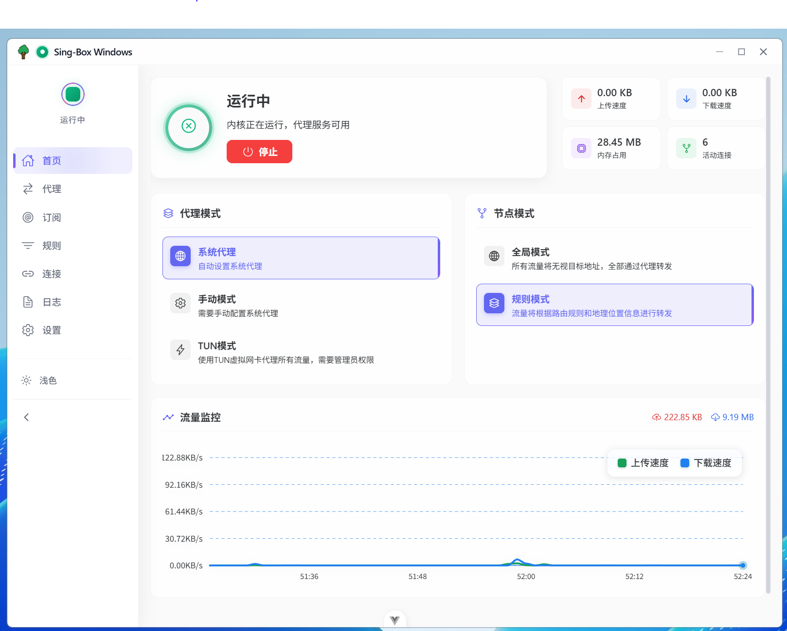

<div align="center">
  

  <h1>Sing-Box Windows</h1>

  <p>
    <strong>A modern Sing-Box GUI client for Windows, Linux, and macOS built with Tauri 2.0 + Vue 3</strong>
  </p>

  <p>
    <a href="#features">✨ Features</a> •
    <a href="#installation">🚀 Installation</a> •
    <a href="#quick-start">🎯 Quick Start</a> •
    <a href="#screenshots">📸 Screenshots</a> •
    <a href="#development">🛠️ Development</a> •
    <a href="#contributing">💡 Contributing</a>
  </p>

  <p>
    <a href="README.zh.md">🇨🇳 中文</a> •
    <a href="README.md">🇺🇸 English</a>
  </p>

  <p>
    <a href="https://github.com/xinggaoya/sing-box-windows/releases">
      
    </a>
    
    
    
  </p>
</div>

---

## 🌟 About

Sing-Box GUI Client is a cutting-edge cross-platform application for Windows, Linux, and macOS that provides a modern, intuitive interface for managing Sing-Box proxy configurations. Built with the powerful combination of Tauri 2.0 and Vue 3, it offers exceptional performance, security, and user experience.

### 🎯 Key Highlights

- **🚀 Blazing Fast**: Built with Rust backend and optimized Vue 3 frontend
- **💎 Modern UI**: Beautiful, responsive interface with Naive UI components
- **🔒 Secure**: Rust-based backend ensures memory safety and performance
- **🌐 Real-time**: WebSocket communication for live updates
- **🎨 Customizable**: Light/Dark themes with extensive personalization options

---

## ✨ Features

### 🎯 Core Functionality
- **Proxy Management**: Easy configuration and switching between different proxy modes
- **Subscription Management**: Automatic subscription updates and management
- **Connection Monitoring**: Real-time connection statistics and monitoring
- **Log Management**: Comprehensive logging with filtering and search
- **Rule Management**: Visual routing rule configuration and management
- **System Integration**: System tray support with quick access controls

### 🎨 User Experience
- **Modern Interface**: Clean, intuitive design based on Naive UI components
- **Multi-language Support**: English, Chinese, Japanese, and Russian
- **Theme System**: Light, Dark, and Auto themes with custom colors
- **Responsive Design**: Optimized for various screen sizes and DPI settings

### 🔧 Advanced Features
- **Real-time Statistics**: Live bandwidth and connection monitoring via WebSocket
- **Auto-start**: Automatic system startup with delayed launch option
- **Update Management**: Automatic update checking and installation
- **Memory Optimization**: Efficient resource management through standard Vue.js and Pinia practices.

---

## 🚀 Installation

### 📥 System Requirements

#### Windows
- **Operating System**: Windows 10/11 (x64)
- **Memory**: 4GB RAM minimum (8GB recommended)
- **Storage**: 100MB free disk space
- **Network**: Internet connection for subscriptions and updates

#### Linux
- **Operating System**: Ubuntu 20.04+, Fedora 36+, Debian 11+, or equivalent distributions
- **Memory**: 4GB RAM minimum (8GB recommended)
- **Storage**: 100MB free disk space
- **Network**: Internet connection for subscriptions and updates
- **Dependencies**: libwebkit2gtk-4.1-0, libssl3, libgtk-3-0 (automatically installed with .deb packages)

#### macOS
- **Operating System**: macOS 10.13 (High Sierra) or higher
- **Memory**: 4GB RAM minimum (8GB recommended)
- **Storage**: 100MB free disk space
- **Network**: Internet connection for subscriptions and updates
- **Architecture**: Intel or Apple Silicon (M1/M2/M3) supported

### 🎯 Installation Methods

#### Method 1: Download Release (Recommended)

**Windows:**
1. Visit the [Releases Page](https://github.com/yourusername/sing-box-windows/releases)
2. Download the latest `sing-box-windows-x.x.x-setup.exe`
3. Run the installer and follow the setup wizard
4. Launch the application from Start Menu or Desktop shortcut

**Linux (.deb - Debian/Ubuntu):**
1. Visit the [Releases Page](https://github.com/yourusername/sing-box-windows/releases)
2. Download the latest `sing-box-windows_x.x.x_amd64.deb`
3. Install using: `sudo dpkg -i sing-box-windows_x.x.x_amd64.deb`
4. If dependencies are missing, run: `sudo apt-get install -f`
5. Launch from your applications menu or run `sing-box-windows`

**Linux (.AppImage - Universal):**
1. Visit the [Releases Page](https://github.com/yourusername/sing-box-windows/releases)
2. Download the latest `sing-box-windows-x.x.x.AppImage`
3. Make executable: `chmod +x sing-box-windows-x.x.x.AppImage`
4. Run: `./sing-box-windows-x.x.x.AppImage`

**macOS (.dmg):**
1. Visit the [Releases Page](https://github.com/yourusername/sing-box-windows/releases)
2. Download the latest `sing-box-windows_x.x.x_aarch64.dmg` for Apple Silicon or `sing-box-windows_x.x.x_x86_64.dmg` for Intel Mac
3. Open the downloaded DMG file
4. Drag the application to your Applications folder
5. Launch from Applications folder or Launchpad

**macOS (.app):**
1. Visit the [Releases Page](https://github.com/yourusername/sing-box-windows/releases)
2. Download the latest `sing-box-windows.app.tar.gz`
3. Extract the archive
4. Move the .app file to your Applications folder
5. Launch from Applications folder

**Linux (Source Compilation):**
1. Clone the repository: `git clone https://github.com/yourusername/sing-box-windows.git`
2. Install dependencies:
   ```bash
   # Ubuntu/Debian
   sudo apt update
   sudo apt install build-essential curl wget libssl-dev libgtk-3-dev libayatana-appindicator3-dev librsvg2-dev

   # macOS (using Homebrew)
   brew install rust node
   ```
3. Install Node.js and Rust (if not already installed)
4. Build the application: `cd sing-box-windows && pnpm tauri build`
5. Find the built application in `src-tauri/target/release/`

#### Method 2: Package Manager

**Windows (Coming Soon):**
```powershell
# Using winget (planned)
winget install sing-box-windows

# Using Chocolatey (planned)
choco install sing-box-windows
```

**macOS (Coming Soon):**
```bash
# Using Homebrew (planned)
brew install sing-box-windows

# Using MacPorts (planned)
sudo port install sing-box-windows
```

**Linux (Not Currently Available):**
```bash
# Note: APT/DNF/Snap repositories are not currently available
# Please use pre-compiled binaries from GitHub Releases or compile from source
```

---

## 🎯 Quick Start

### 1. Initial Setup
After installation, the application will guide you through the initial setup:

1. **Language Selection**: Choose your preferred language
2. **Theme Configuration**: Select Light/Dark/Auto theme
3. **Network Settings**: Configure basic network settings

### 2. Add Subscription
1. Navigate to the **Subscription** tab
2. Click **Add Subscription**
3. Enter your subscription URL and name
4. Configure update settings
5. Click **Save and Update**

### 3. Configure Proxy
1. Go to the **Proxy** tab
2. Select your preferred server from the list
3. Choose proxy mode (Global, Rule, Direct)
4. Toggle **Connect** to activate

### 4. Monitor Connections
1. Visit the **Connections** tab
2. View real-time connection statistics
3. Monitor bandwidth usage
4. Filter and search connections

---

## 📸 Screenshots

<div align="center">
  

  <p><em>Main application interface showing proxy management and system status</em></p>
</div>

---

## 🛠️ Development

### 📋 Prerequisites

- **Node.js**: 18+ (recommend using [pnpm](https://pnpm.io/))
- **Rust**: 1.70+ with nightly toolchain
- **Tauri CLI**: Latest version

### 🚀 Setup Development Environment

1. **Clone Repository**
   ```bash
   git clone https://github.com/xinggaoya/sing-box-windows.git
   cd sing-box-windows
   ```

2. **Install Dependencies**
   ```bash
   # Install frontend dependencies
   pnpm install

   # Install Rust dependencies (automatic)
   ```

3. **Start Development Server**
   ```bash
   # Start development mode with hot reload
   pnpm tauri dev
   ```

4. **Build for Production**
   ```bash
   # Build release version
   pnpm tauri build
   ```

### 🧪 Development Commands

```bash
# Development
pnpm tauri dev          # Start development server with hot reload

# Building
pnpm tauri build        # Build release version (for current platform)

# Platform-specific builds
pnpm tauri build:windows          # Build Windows version
pnpm tauri build:linux            # Build Linux version
pnpm tauri build:macos            # Build macOS version (ARM64)
pnpm tauri build:macos:intel      # Build macOS version (Intel)

# Package formats
pnpm tauri build:macos:dmg        # Build macOS DMG
pnpm tauri build:macos:app        # Build macOS APP

# Code Quality
pnpm lint               # Run ESLint and OXLint with auto-fix
pnpm format             # Format code with Prettier
pnpm type-check         # TypeScript type checking

# Frontend only
pnpm dev                # Start Vite dev server
pnpm build              # Build frontend only
```

### 🏗️ Project Structure

```
sing-box-windows/
├── 📁 src/                    # Frontend (Vue 3)
│   ├── 📁 components/         # Reusable components
│   │   ├── 📁 home/          # Dashboard components
│   │   ├── 📁 layout/        # Layout components
│   │   └── 📁 common/        # Common UI components
│   ├── 📁 stores/            # Pinia state management
│   ├── 📁 services/          # Business logic services
│   ├── 📁 utils/             # Utility functions
│   ├── 📁 locales/           # Internationalization
│   └── 📁 views/             # Page components
├── 📁 src-tauri/             # Backend (Rust)
│   ├── 📁 src/
│   │   ├── 📁 app/           # Application modules
│   │   │   ├── 📁 core/      # Core functionality
│   │   │   ├── 📁 network/   # Network operations
│   │   │   └── 📁 system/    # System integration
│   │   └── 📄 main.rs        # Application entry point
│   └── 📄 Cargo.toml         # Rust dependencies
└── 📁 docs/                  # Documentation
```

---

## 🔧 Configuration

### 📄 Storage System

This application uses **Tauri Store Plugin** for backend data persistence, which provides secure and efficient storage using binary database files.

### 🗄️ Storage Location

- **Windows**: `%APPDATA%\sing-box-windows\*.bin` (binary database files)
- **Linux**: `~/.local/share/sing-box-windows/*.bin` (binary database files)
- **macOS**: `~/Library/Application Support/sing-box-windows/*.bin` (binary database files)
- **Portable**: `<app-directory>\*.bin` (binary database files)

### ⚙️ Configuration Structure

The application stores configuration data in structured binary files using Tauri's Store plugin. Key configuration areas include:

#### Application Settings (`app.bin`)
```typescript
{
  language: "en-US" | "zh-CN" | "ja-JP" | "ru-RU",
  theme: "light" | "dark" | "auto",
  proxyMode: "system" | "tun" | "manual",
  autoStartKernel: boolean,
  preferIpv6: boolean,
  proxyPort: number,      // Default: 12080
  apiPort: number         // Default: 12081
}
```

#### Theme Settings (`theme.bin`)
```typescript
{
  primaryColor: string,
  isDark: boolean,
  followSystem: boolean
}
```

#### Subscription Data (`subscription.bin`)
```typescript
{
  subscriptions: Array<{
    id: string,
    name: string,
    url: string,
    autoUpdate: boolean,
    lastUpdate: string
  }>
}
```

### 🔧 Data Persistence Features

- **Binary Storage**: Uses efficient binary format for fast read/write operations
- **Automatic Sync**: Real-time data synchronization between frontend and backend
- **Memory Optimization**: Intelligent caching and lazy loading for large datasets
- **Data Integrity**: Built-in validation and error recovery mechanisms
- **Cross-session Persistence**: All settings and data preserved across application restarts

---

## 🤝 Contributing

We welcome contributions from the community! Here's how you can help:

### 🎯 Ways to Contribute

1. **🐛 Report Bugs**: Found an issue? [Open an issue](https://github.com/xinggaoya/sing-box-windows/issues)
2. **💡 Feature Requests**: Have an idea? [Suggest a feature](https://github.com/xinggaoya/sing-box-windows/discussions)
3. **🔧 Code Contributions**: Fork and submit pull requests
4. **📖 Documentation**: Help improve documentation
5. **🌐 Translation**: Contribute to [localization](src/locales/)

### 🚀 Development Workflow

1. Fork the repository from [GitHub](https://github.com/xinggaoya/sing-box-windows)
2. Create a feature branch: `git checkout -b feature/amazing-feature`
3. Make your changes and test thoroughly
4. Commit your changes: `git commit -m 'Add amazing feature'`
5. Push to the branch: `git push origin feature/amazing-feature`
6. Open a Pull Request

### 📋 Code Style Guidelines

- **Frontend**: Follow [Vue 3 Style Guide](https://vuejs.org/style-guide/)
- **Backend**: Follow [Rust API Guidelines](https://rust-lang.github.io/api-guidelines/)
- **Commits**: Use [Conventional Commits](https://www.conventionalcommits.org/)
- **Linting**: Code should pass both ESLint and OXLint checks

---

## 🙏 Acknowledgments

- [Sing-Box](https://github.com/SagerNet/sing-box) - The powerful proxy core
- [Tauri](https://tauri.app/) - Amazing Rust-based app framework
- [Vue.js](https://vuejs.org/) - Progressive JavaScript framework
- [Naive UI](https://www.naiveui.com/) - Beautiful Vue 3 component library
- [Vite](https://vitejs.dev/) - Fast build tool and dev server

---

## 📄 License

This project is licensed under the MIT License - see the [LICENSE](LICENSE) file for details.

---

<div align="center">
  <p>
    <strong>Built with ❤️ by XingGao</strong>
  </p>
  <p>
    <a href="https://github.com/xinggaoya/sing-box-windows">
      
    </a>
    <a href="https://github.com/xinggaoya/sing-box-windows/fork">
      
    </a>
  </p>
</div>