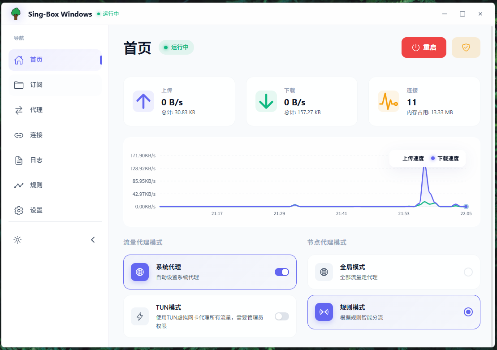

# Sing-Box Windows

<div align="center">
    
    <h1>Sing-Box Windows</h1>
    <p>🚀 一个优雅现代的 Sing-Box Windows GUI 客户端</p>
    <p>
        
        
        
        
        
    </p>
    <p>
        <a href="README.zh.md">中文</a> | 
        <a href="README.md">English</a>
    </p>
</div>

## 🎯 核心特性

### 🖥️ **现代化用户界面**

- 基于 [Tauri 2.0](https://tauri.app/) 和 [Vue 3](https://vuejs.org/) 构建，性能卓越
- 采用 [Naive UI](https://www.naiveui.com/) 组件库的响应式设计
- 支持亮色/暗色主题，自动跟随系统设置
- 直观友好的用户界面设计

### 🌐 **全面的代理支持**

- **系统代理模式**：自动配置系统级代理
- **TUN 模式**：网络层级流量路由（需要管理员权限）
- **手动模式**：为高级用户提供自定义代理配置
- 智能代理切换，一键切换模式

### 📊 **高级统计与监控**

- 实时流量监控，配备精美图表
- 连接统计和活动连接查看器
- 内存使用监控
- 历史数据追踪
- 带宽使用分析

### 🔄 **订阅管理**

- 支持多种订阅格式：
  - 直接订阅链接
  - Sing-box JSON 配置
  - 自动 Base64 解码
- 自动订阅更新
- 订阅分组和管理
- 导入/导出配置

### 🔍 **完整的日志系统**

- 实时日志查看，支持语法高亮
- 多级日志（信息、警告、错误）
- 日志过滤和搜索功能
- 导出日志用于调试
- 自动日志轮转

### ⚡ **性能优化**

- 内存管理和内存泄漏防护
- 高效的 WebSocket 连接
- 懒加载和虚拟滚动
- 重型操作的后台处理
- 最小资源占用

### 🔒 **安全特性**

- 安全的配置存储
- TUN 模式自动权限提升
- 安全的订阅解析
- 进程隔离

### 🌍 **国际化支持**

- 多语言支持
- 目前支持的语言：
  - English（英语）
  - 中文（简体中文）
  - 日本語（日语）
  - Русский（俄语）
- 易于添加新语言

## 📸 界面预览

<div align="center">
    
    <p><em>主界面展示代理状态、统计信息和控制功能</em></p>
</div>

## 🚀 快速开始

### 系统要求

- **操作系统**：Windows 10 1809 或更高版本
- **架构**：x64（64位）
- **内存**：推荐 4GB RAM
- **磁盘空间**：100MB 可用空间
- **网络**：需要互联网连接以下载内核和订阅

### 下载安装

1. **下载**：从 [Releases](https://github.com/xinggaoya/sing-box-windows/releases) 页面获取最新版本
2. **安装**：运行安装程序（`.msi` 或 `.exe` 安装文件）
   - 安装程序支持自动更新
   - 可选择安装目录
3. **首次启动**：应用程序将自动完成必要配置

### 基本使用

#### 🔧 **初始设置**

1. **下载 Sing-Box 内核**：

   - 进入【设置】→【内核管理】
   - 点击"下载最新内核"
   - 等待自动安装完成

2. **配置订阅**：
   - 进入【订阅】页面
   - 点击"添加订阅"
   - 输入订阅链接或导入 JSON 配置
   - 应用支持自动 Base64 解码

#### 🌐 **连接代理**

1. **选择节点**：

   - 进入【主页】
   - 浏览来自订阅的可用节点
   - 使用"测试"按钮测试节点延迟
   - 选择首选节点

2. **选择代理模式**：

   - **系统代理**：自动系统级配置
   - **TUN 模式**：网络级路由（需要管理员权限）
   - **手动**：自定义配置

3. **连接**：
   - 点击"连接"按钮
   - 实时监控连接状态
   - 查看流量统计和活动连接

> **💡 提示**：使用 TUN 模式时，应用程序会请求管理员权限并自动配置系统设置

### 高级功能

#### 📋 **规则管理**

- 进入【规则】页面查看和管理路由规则
- 支持自定义规则集
- 从订阅自动更新规则
- 规则优先级管理

#### 🛠️ **系统集成**

- **系统托盘**：从 Windows 系统托盘快速访问
- **开机自启**：配置 Windows 启动时自动启动
- **自动连接**：自动连接到上次使用的配置
- **通知**：连接状态的桌面通知

#### 📊 **高级监控**

- **连接**：查看活动连接及其详细信息
- **流量分析**：详细的带宽使用统计
- **性能指标**：内存使用和系统性能
- **日志**：具有过滤选项的综合日志记录

## 🛠️ 开发指南

### 环境要求

- **Node.js**：18.0 或更高版本
- **Rust**：最新稳定版（1.70+）
- **Visual Studio**：2019 或更高版本，需包含 C++ 开发工具
- **Git**：最新版本
- **pnpm**：包管理器

### 本地开发

```bash
# 克隆仓库
git clone https://github.com/xinggaoya/sing-box-windows.git
cd sing-box-windows

# 安装依赖
pnpm install

# 启动开发服务器（支持热重载）
pnpm tauri dev

# 构建生产版本
pnpm tauri build

# 运行测试
pnpm test

# 类型检查
pnpm type-check

# 代码检查
pnpm lint
```

### 开发文档

获取完整的开发文档，请查看：

- [开发指南](./docs/development.md) - 详细的开发说明
- [国际化指南](./docs/i18n.md) - 添加新语言

### 项目架构

```
sing-box-windows/
├── src/                    # 前端源代码
│   ├── components/        # 可复用的 Vue 组件
│   │   ├── home/         # 主页组件
│   │   ├── layout/       # 布局组件
│   │   └── ...           # 其他组件分类
│   ├── stores/           # Pinia 状态管理
│   │   ├── app/          # 应用级状态
│   │   ├── kernel/       # 内核相关状态
│   │   ├── subscription/ # 订阅管理
│   │   └── tray/         # 系统托盘集成
│   ├── services/         # 业务逻辑服务
│   ├── utils/            # 工具函数
│   ├── locales/          # 国际化文件
│   └── views/            # 页面组件
├── src-tauri/            # Rust 后端代码
│   ├── src/              # Rust 源代码
│   │   ├── app/          # 应用模块
│   │   │   ├── core/     # 核心功能
│   │   │   ├── network/  # 网络操作
│   │   │   └── system/   # 系统集成
│   │   ├── utils/        # 工具函数
│   │   └── main.rs       # 应用入口点
│   └── Cargo.toml        # Rust 依赖
├── docs/                 # 文档
└── public/               # 静态资源
```

## 📦 技术栈

### 前端技术

- 🎯 **[Tauri 2.0](https://tauri.app/)** - 现代化跨平台应用框架
- ⚡ **[Vue 3](https://vuejs.org/)** - 渐进式 JavaScript 框架
- 🎨 **[Naive UI](https://www.naiveui.com/)** - 高质量 Vue 3 组件库
- 📊 **[Canvas API](https://developer.mozilla.org/en-US/docs/Web/API/Canvas_API)** - 高性能图形渲染
- 🔧 **[TypeScript](https://www.typescriptlang.org/)** - 类型安全的 JavaScript
- 🗃️ **[Pinia](https://pinia.vuejs.org/)** - Vue 状态管理
- 🛣️ **[Vue Router](https://router.vuejs.org/)** - Vue.js 官方路由

### 后端技术

- 🦀 **[Rust](https://www.rust-lang.org/)** - 高性能系统编程语言
- ⚡ **[tokio](https://tokio.rs/)** - Rust 异步运行时
- 🔗 **[serde](https://serde.rs/)** - 序列化框架
- 🌐 **[reqwest](https://github.com/seanmonstar/reqwest)** - HTTP 客户端库

### 工具和基础设施

- 📦 **[pnpm](https://pnpm.io/)** - 快速、磁盘空间高效的包管理器
- 🔍 **[ESLint](https://eslint.org/)** - JavaScript/TypeScript 代码检查
- 🎨 **[Prettier](https://prettier.io/)** - 代码格式化
- 🏗️ **[Vite](https://vitejs.dev/)** - 下一代前端构建工具

## 🤝 贡献指南

我们欢迎各种形式的贡献！以下是您可以提供帮助的方式：

### 贡献类型

- 🐛 **错误报告**：报告问题和错误
- 💡 **功能请求**：建议新功能
- 📝 **文档**：改进文档
- 🔧 **代码贡献**：修复错误或实现功能
- 🌍 **翻译**：添加对新语言的支持
- 🎨 **UI/UX 改进**：增强用户界面

### 贡献流程

1. **Fork** 仓库
2. **Clone** 您的 fork 到本地
3. **创建** 功能分支（`git checkout -b feature/amazing-feature`）
4. **进行** 更改并编写清晰的提交消息
5. **测试** 您的更改
6. **推送** 到您的分支（`git push origin feature/amazing-feature`）
7. **提交** 带有详细描述的 Pull Request

### 开发指南

- 遵循现有的代码风格和约定
- 编写有意义的提交消息
- 为新功能添加测试
- 必要时更新文档
- 确保所有测试在提交前通过

### 翻译贡献

添加新语言：

1. 在 `src/locales/` 中创建新文件（例如 `fr-FR.ts`）
2. 从 `en-US.ts` 复制结构
3. 翻译所有文本字符串
4. 将语言添加到语言选择器
5. 彻底测试翻译

## 📄 许可证

本项目采用 [MIT 许可证](LICENSE) - 详情请查看 LICENSE 文件。

## 📮 支持与社区

- 🐛 **错误报告**：[GitHub Issues](https://github.com/xinggaoya/sing-box-windows/issues)
- 💬 **讨论**：[GitHub Discussions](https://github.com/xinggaoya/sing-box-windows/discussions)
- 📧 **邮件**：[联系维护者](mailto:your-email@example.com)
- 📘 **文档**：[开发文档](./docs/development.md)

## 🙏 致谢

特别感谢这些优秀的项目和贡献者：

### 核心技术

- **[sing-box](https://github.com/SagerNet/sing-box)** - 强大的代理平台
- **[Tauri](https://tauri.app/)** - 安全、快速、轻量级的应用程序框架
- **[Vue.js](https://vuejs.org/)** - 渐进式 JavaScript 框架
- **[Naive UI](https://www.naiveui.com/)** - 美观强大的 UI 组件库

### 社区

- **[所有贡献者](https://github.com/xinggaoya/sing-box-windows/graphs/contributors)** - 感谢您的宝贵贡献
- **用户和测试者** - 您的反馈帮助改进应用程序
- **翻译者** - 让应用程序走向世界

## 📈 路线图

### 即将推出的功能

- [ ] 插件系统以提供扩展性
- [ ] 自定义主题和 UI 定制
- [ ] 高级路由规则编辑器
- [ ] 云配置同步
- [ ] 移动端配套应用
- [ ] 网络诊断工具

### 版本历史

- **v1.7.9** - 当前稳定版本
- **v1.7.x** - 性能优化和错误修复
- **v1.6.x** - 增强的 UI 和国际化
- **v1.5.x** - 初始公开发布

---

<div align="center">
    <p>如果这个项目对您有帮助，请考虑给它一个 ⭐️！</p>
    <p>由 Sing-Box Windows 团队用 ❤️ 制作</p>
</div>
